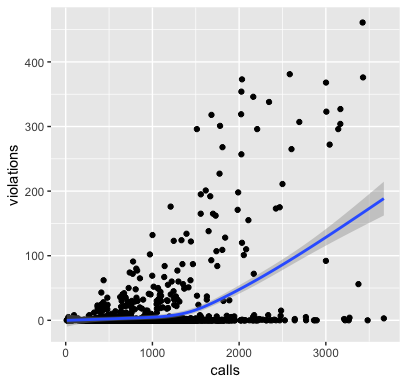

```{r setup, include=FALSE}
knitr::opts_chunk$set(echo = TRUE)
```

# Introduction

## Question

What is the relationship between the number of 311 calls from geographic area and the number of housing violations that occur within it?


## 311

311 is a phone number in New York City that allows citizens can to report civil, non-emergency events, e.g., graffiti or noise complaints


## Goal

- The end goal is to build a model to predict housing violations

- A successful model could potentially

    * Allow the city government to plan and target housing inspections faster and 
      more efficiently
      
    * Help civil rights to detect potential discrimination


# Data

## 311 Calls

- NYC Open Data web site: [data.cityofnewyork.us](https://opendata.cityofnewyork.us) houses a log of every 311 call made since 2010, and updated daily

- Accessible via API endpoint

- Millions of 311 calls are made each year, so I limit this project to the year 2014 only

- Records contain geographic information (address, borough, latitude and longitude), creation and close date, and compaint type


## Housing Violations

- Also archived by NYC Open Data, and accessible by API endpoint

- 23 thousand housing violations reported in 2014

- Important columns here include various dates (of inspection, certification, etc.), geographic information (address, lat/long, Census tract, etc.), a description of the violation, and violation status


## Demographic Data

- Available via an easy-to-use R package called `tidycensus`: https://walkerke.github.io/tidycensus/ -- which wraps the Census Bureau's API (requires token)

- Census data can be aggregated at various geographical levels -- I chose zip code

- There are hundreds of possible variables from the Census, but to keep it simple, I focused on measures of a zip code's:
    
    * Education
    * Language
    * Income
    * Age
    * Race/ethnicity
    

## Demographic Data

- Beware of multicollinearity: Most of these variables are related to eachother


## Dependent Variable

- The number of housing violations per zip code per month

|zip   |epoch      | violations|
|:-----|:----------|----------:|
|10001 |2014-01-01 |          4|
|10001 |2014-02-01 |         10|
|10001 |2014-03-01 |          0|
|10001 |2014-04-01 |          0|
|10001 |2014-05-01 |          1|
|\vdots |\vdots   |      \vdots|


## Independent Variable: 311 Calls

- Aggregated to number of 311 calls per zip code per month

|zip   |epoch      | calls|
|:-----|:----------|-----:|
|00083 |2014-01-01 |     2|
|00083 |2014-02-01 |     5|
|00083 |2014-03-01 |     8|
|00083 |2014-04-01 |    14|
|00083 |2014-05-01 |     9|
|\vdots |\vdots    |\vdots|


## Independent Variables: Demographics 

- Transform to percentage of total population per zip code

- E.g., 27.7 percent of residents in zip code have a bachelors degree, and 73 percent speak English


# Exploratory Data Analysis

## Scatterplot of `(calls, violations)`

```{r, echo=FALSE, out.height='220px', fig.align='center'}

```


## Correlations

```{r, echo=FALSE, out.height='220px', fig.align='center'}
knitr::include_graphics('./img/cor.png')
```


# Models

## Evaluation

- Split into train and test sets (70 percent, 30 percent)

- Evaluate on mean squared error $MSE$ (and $R^2$)

```{r, eval=FALSE}
mse <- function(m) mean(resid(m)^2)

calc_r2 <- function(y, y_hat) {
    rss <- sum((y_hat - y)^2)
    tss <- sum((y - mean(y_hat))^2)
    return(1 - (rss/tss))
}
```

## $M_0$: Dummy Model

- Predicts the mean of `violations`

- Useful to establish a baseline

```{r, eval=FALSE}
m0 <- lm(violations ~ 1, train)
```


## $M_1$: Simple Linear Regression

- Use all variables to predict `violations` in straight forward model

```{r, eval=FALSE}
m1 <- lm(violations ~ calls + bach_degree + 
             bachelors + below_poverty + 
             grad_degree + hs + income_high + 
             married + median_age + no_hs + 
             pop_black + pop_hispanic + pop_white + 
             speak_english + speak_spanish +
             total_pop, train)
```


## $M_2$: Regression + Month

- Examining the residuals, it became clear the observations this model had the most trouble with were in the winter---January and February

- Remedy by adding a `month` factor variabel


## $M_3$: Mixed Effects Panel Model

- In fact, linear regression is inappopriate for this data set

- Linear regression assumes each observation is independent of eachother

- Because each subject (zip code) is sampled numerous times, this assumption is violated


## $M_3$: Mixed Effects Panel Model

- This can be remedied by using a mixed effects model via R package `lmer4`

```{r, eval=FALSE}
library(lmer4)
m3 <- lmer(violations ~ calls + bach_degree + 
             bachelors + below_poverty + 
             grad_degree + hs + income_high + 
             married + median_age + no_hs + 
             pop_black + pop_hispanic + pop_white + 
             speak_english + speak_spanish +
             total_pop + (1 | zip) + (1 | month), 
           data=train)
```


## $M_4$: Dealing with Multicollinearity

- Including so many variables that are correlated to eachother can cause the model to misestimate parameter values, reducing its predictive capability

- $M_4$ is also a mixed effects model, but eliminates some of the most correlated independent variables


## $M_5$: Zero-Inflated Poisson Regression

_NOTE: This is new territory for me, just trying it out for the first time!_

- The dependant variable `violations` is actually a count, suggesting a Poisson regression may be more appropriate

- `violations` has a lot of zeros, so use this this special Poisson model

```{r, eval=FALSE}
library(pscl)
m5 <- zeroinfl(violations ~ calls + bach_degree + 
               bachelors + below_poverty + 
               grad_degree + hs + income_high + 
               married + median_age + no_hs + 
               pop_black + pop_hispanic + pop_white + 
               speak_english + speak_spanish +
               total_pop + | month, train)
```


# Model Evaluation

## Test Set $MSE$

|       | Type                |  MSE |
|-------|---------------------|-----:|
| $M_0$ | Dummy               | 2657 |
| $M_1$ | Simple LR           | 1849 |
| $M_2$ | LR + Month          | 1305 |
| $M_3$ | Mixed Effects       | 1306 |
| $M_4$ | Mixed Effects -     | 1303 |
| $M_5$ | 0-Inflated Poisson  |  758 |


## Test Set $R^2$

|       | Type               | $R^2$ |
|-------|--------------------|------:|
| $M_0$ | Dummy              |     0 |
| $M_1$ | Simple LR          |  0.30 |
| $M_2$ | LR + Month         |  0.51 |
| $M_3$ | Mixed Effects      |  0.51 |
| $M_4$ | Mixed Effects -    |  0.51 |
| $M_5$ | 0-Inflated Poisson |  0.72 |


# Conclusion


## Lessons

- Examining a model's residuals can suggest simple ways to greatly improve the model, as with the `month` variable that increased $R^2$ by 70 percent

- Even though $M_4$ and $M_3$ had the same performance, their parameter estimates were very different because of the adjustments I made to counter multicollinearity

- It is important to understand your data and pick the appropriate modelling framework


## Findings

- Every model found a highly significant and positive relationship between the number of calls to 311 and housing violations in New York City zip codes

- The best model, the zero-inflated Poisson model $M_5$, estimates that every 1175 calls to 311 is associated with one housing violation

- The proportion of residents living below the poverty line is also positively and significantly associated with housing violations

- A big thank you to whomever made `tidycensus` for making this project immensely easier


# The End


